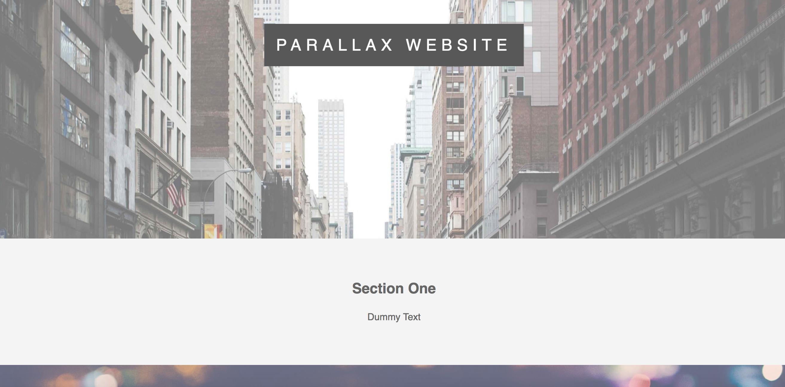

# Parallax-Demo

Welcome to my Parallax Demo Repository!

I'll be using this space to practice using Parallax while I build my web applications!

Feel free to leave any feedback, positive or negative. I'll happily accept both!

This demo was a product of a demo I found online [here](https://www.youtube.com/watch?v=JttTcnidSdQ).
I had been curious about how to use Parallax to provide a smoother user experience.

To see the full webpage, click [here](https://tonywzhang.github.io/Parallax-Demo/).

Shown below is a sample of the final product:

